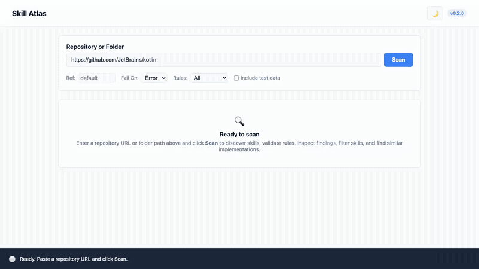

# Skill Atlas

[](https://github.com/avalur/skill-atlas/actions/workflows/ci.yml)

> CLI tool for discovery, structural validation, and static security audit of AI Agent Skills.

## 🎯 Project Purpose

AI agents increasingly rely on extensions and capabilities (Agent Skills) structured as folders containing a `SKILL.md` specification, instructions, scripts, and manifests. 
As the number of skills grows, key challenges emerge:
1. **Validity and Consistency**: Missing required fields, broken script links, invalid YAML frontmatter.
2. **Security**: Leaked API keys and access tokens, potentially destructive shell commands (`rm -rf`, `curl | sh`), prompt injection attempts.
3. **Discoverability**: Vague or duplicate descriptions that prevent agents from routing and selecting the right tool.

`Skill Atlas` (`skill-atlas`) solves these problems by providing a fast, standalone static scanner CLI.

---

## 📺 Demo

<p align="center">
  <a href="docs/assets/demo.mp4">
    
  </a>
  <br />
  <em>🔊 <strong>Click the image or <a href="docs/assets/demo.mp4">watch the narrated HD walkthrough (MP4, 92 s)</a></strong></em>
</p>

---

## 🚀 Features (v0.2.0)

- **Multi-Repository Scanning & Search**:
  - Scan multiple local directories, local Git repositories, and remote GitHub repositories in a single run.
  - Ingest target repositories via positional CLI arguments or newline-delimited text files (`--targets-file / -T`).
  - **Audit-Scoped Search (`--query / -q`)**: Filter skills across all targets before rule evaluation, running security audits specifically on matching skills to maximize scan speed.
  - Cross-repository isolation preserving individual repository provenance without conflating skills across targets.
- **Git Repositories & Discovery**:
  - Scanning local directories and local Git repositories.
  - Remote Git repository ingestion directly via GitHub REST API (zero disk waste, no cloning).
  - Pinned branch/tag/commit reference support (`--ref`).
- **Organization-Wide Scanning (performance-oriented)**:
  - Scan every public repository of a GitHub organization (or user) with a single target: `org:JetBrains`, `https://github.com/orgs/JetBrains`, or `https://github.com/JetBrains`.
  - Concurrent, zero-clone repository tree scanning with bounded concurrency (`--concurrency / -j`) and shared connection pooling for high throughput.
  - Archived repositories and forks excluded by default (`--include-archived`, `--include-forks`); cap the scan with `--max-repos`.
  - Paginated REST enumeration with `Retry-After`, rate-limit, and SAML SSO resilience, plus live per-repository progress.
- **Layout Intelligence & Provenance**:
  - **Origin Classification**: Automatically labels skills by category (`agent-config`, `product`, `test-data`, `standalone`).
  - **Deduplication & Stale Copy Detection (`DSC-001`)**: Groups duplicate copies across `.claude`, `.agents`, etc., displays the newest copy, and alerts if copies have drifted.
  - **Test Data Isolation**: Classifies test fixtures and excludes their findings from blocking exit codes unless `--include-test-data` is specified.
  - **Git Provenance**: Automatically resolves the introductory commit and the latest update commit and timestamp for each skill.
- **Specification & Security Audit**:
  - Schema consistency (`SCH-001` through `SCH-006`).
  - Static security auditing for exposed secrets, destructive commands, unsafe pipes, sensitive paths, and prompt injection (`SEC-001` through `SEC-005`).
- **Heuristic Similarity Discovery (No AI)**:
  - Find similar and overlapping skills using fast, transparent heuristics (`skill-atlas similar`).
  - Multi-feature composite scoring (name token overlap, description TF-IDF/cosine similarity, shared tags, prompt structure, companion script names).
  - Human-readable match reasons and feature breakdown.
- **The Skill Map & Categorical Clustering**:
  - Thematic clustering using heuristic shared words, Claude Code AI (`--ai`), or TypeSafe Jev (`--jev`).
  - Automatic category labeling with actionable rationales.
  - Interactive Web UI drawer and card matrix with instant keyword filtering and deterministic replay support.
- **Interactive Local Web Interface**:
  - Launch an interactive local catalog with `skill-atlas serve` (supporting `--reload` for development).
  - Multi-repository input textarea, sample repositories loader, and dynamic repository filter chips.
  - Real-time SSE streaming reporting per-target progress (`[index/total: repo_name]`) and GitHub rate limits.
  - Light and dark theme switcher with system preference detection and localStorage persistence.
  - Interactive "Find Similar" tool with threshold controls, keyword and status filters, and instant JSON download.
- **Reporting & CI/CD**:
  - Formatted terminal output via Rich.
  - Machine-readable structured JSON export.
  - Deterministic exit codes (`0`, `1`, `2`).

---

## ⚡ Quickstart

```bash
# Install dependencies
uv sync

# Scan single local directory or repository
uv run skill-atlas scan ./skills

# Scan multiple repositories with an audit-scoped query
uv run skill-atlas scan ./team-skills ./core-skills -q git

# Scan repositories listed in a targets file
uv run skill-atlas scan -T targets.txt

# Scan remote GitHub repository without cloning
uv run skill-atlas scan https://github.com/JetBrains/kotlin

# Scan an entire GitHub organization concurrently (zero-clone)
uv run skill-atlas scan https://github.com/JetBrains
uv run skill-atlas scan org:JetBrains --concurrency 12 --max-repos 100

# Find similar skills in a repository or folder
uv run skill-atlas similar ./skills --threshold 0.5

# Generate Skill Map (heuristic, Claude AI, or TypeSafe Jev)
uv run skill-atlas map ./skills
uv run skill-atlas map ./skills --ai
uv run skill-atlas map ./skills --jev

# Launch local interactive Web UI
uv run skill-atlas serve
```

---

## 🛠 Tech Stack

- Python 3.11+
- [uv](https://github.com/astral-sh/uv) — fast Python package and environment manager
- Typer + Rich — modern CLI framework and terminal formatting
- Pydantic v2 — data model and schema validation
- Pytest — testing suite

---

## 📚 Documentation

- [SPEC.md](./SPEC.md) — Iteration 1 specification (CLI MVP).
- [AGENTS.md](./AGENTS.md) — Instructions, architectural conventions, and guidelines for AI agents.
- [memory/](./memory/README.md) — Persistent shared memory capturing past decisions, architectural patterns, and gotchas across agent sessions.
